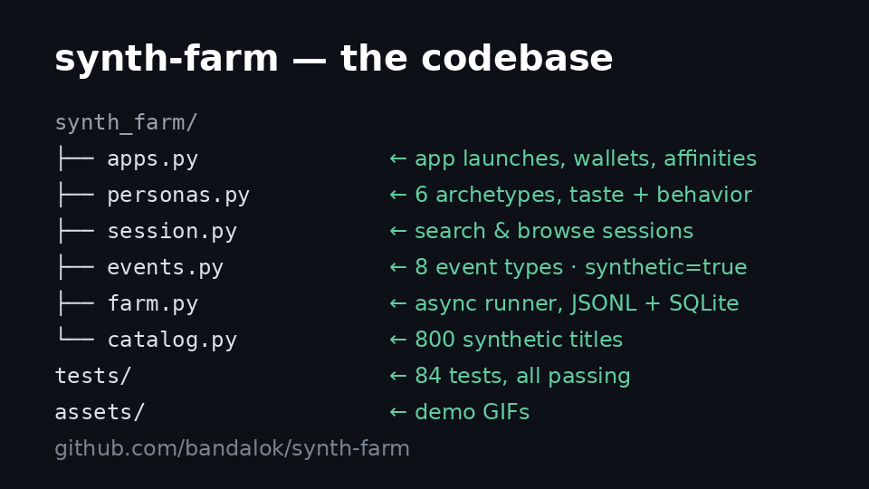

# synth-farm

A persona-driven synthetic user farm for cold-start recommender systems.

`synth-farm` simulates thousands of streaming-service users — each with a
distinct taste profile, activity rhythm, and interaction style — browsing,
searching, clicking, watching, and abandoning content. Every interaction is
emitted as a structured, timestamped event with `synthetic=true`, producing
training and evaluation data for recommendation models without touching a
single real user.

Built for one job: **give a brand-new recommender something honest to learn
from on day zero**, when there is no logged traffic yet and every model is
guessing.

> **Abuse warning.** This tool is designed for platforms you own or control
> (your staging environment, your load-test harness, your offline simulator).
> Pointing a synthetic traffic generator at a third-party service you do not
> operate is abuse: it pollutes their analytics, wastes their resources, and
> will get your accounts and IP ranges banned. Do not do it.

---

## Demo

One GIF: the codebase, the technical run, and the story it tells — what 500
synthetic viewers do on a CTV platform in 19 seconds. Real farm output, zero
jargon:



---

## Contents

- [Why synthetic users?](#why-synthetic-users)
- [Quickstart](#quickstart)
- [How it works](#how-it-works)
- [Architecture](#architecture)
- [Personas](#personas)
- [The event schema](#the-event-schema)
- [Position bias, modeled honestly](#position-bias-modeled-honestly)
- [Configuration](#configuration)
- [Using your own platform (adapters)](#using-your-own-platform-adapters)
- [Training a model on farm output](#training-a-model-on-farm-output)
- [Caveats](#caveats)
- [Roadmap](#roadmap)
- [License](#license)

---

## Why synthetic users?

A recommender team on day zero faces a paradox: the model needs behavior
data to learn, but behavior data only arrives once the model is live. The
usual escapes are all flawed:

- **Launch with popularity rankings** — works, but teaches you nothing about
  personalization, and the position bias it creates poisons later training.
- **Buy or scrape a public dataset** — different catalog, different users,
  different biases; the transfer rarely survives contact with your product.
- **Hand-label relevance** — expensive, static, and blind to the dynamics
  (abandonment, session drift, weekend binges) that make or break a model.

`synth-farm` takes a fourth path: define the *demand side* — who your users
are, what they like, how they browse — and let behavior emerge from a
simulated platform. Because you control the ground truth (each persona's
latent taste vector), you can measure exactly what a model recovers: not a
proxy metric on borrowed data, but recall of genuinely held-out preferences.

The farm is a laboratory instrument, not a replacement for real traffic.
Its job is to de-risk the cold start: validate your training pipeline,
tune hyperparameters, and prove the model beats random *before* the first
real user arrives.

---

## Quickstart

No API keys. No network. One command:

```bash
pip install -e .
python -m synth_farm --demo
```

The demo spins up 300 personas, simulates a week of streaming behavior,
trains an implicit-feedback ALS model from scratch on the emitted events,
and evaluates it on held-out users it never trained on. On a laptop it
takes about ten seconds and ends with something like:

```
[farm] 33,461 events from 1,071 sessions in 9.2s
Held-out evaluation (K=20, 12 eval personas):
  recall@20        : 0.417
  random baseline     : 0.025
  lift vs random      : 16.7x
Sample recommendations vs persona taste:
  persona-00187 [binge_watcher] loves scifi 24%, documentary 17%
    -> recommends: Solar Odyssey [scifi], Void Expanse [scifi],
                   Solar Colony [scifi], Stellar Vector [scifi], ...
```

### The three CLI commands

```bash
# 1. Full demo: simulate + train + evaluate, print a report
python -m synth_farm --demo

# 2. Simulate at scale and persist events (JSONL and/or SQLite)
python -m synth_farm run --personas 1000 --days 7 --seed 42 \
    --events events.jsonl --db events.db

# 3. Train + evaluate on previously generated events
python -m synth_farm train --events events.jsonl --personas 1000 --seed 42
```

`train` rebuilds the persona population and catalog deterministically from
the seed, so the taste vectors shown in the report ("loves scifi 24%") are
the same ground truth that generated the events.

---

## How it works

A run proceeds in five stages:

1. **Population.** `N` personas are sampled from six archetypes. Each gets
   a latent taste vector (a distribution over genres), an activity rate, and
   behavioral propensities (clickiness, patience, completion tendency).
2. **Scheduling.** Each persona's sessions are scattered across the window
   with a Poisson process, diurnal rhythm (evening peaks), and a weekend
   boost — so traffic looks like traffic, not a uniform grid.
3. **Sessions.** A session is a sequence of *units*: browse a rail, run a
   search, or both. Every recommendation slate and search result is logged
   as an `impression` event, so position bias is observable, not assumed.
4. **Interaction.** A cascade click model decides what gets clicked
   (position-decayed appeal, with abandonment). Clicks lead to watch
   sessions with quartile progress, completion, or abandonment — driven by
   the match between item content and persona taste.
5. **Learning.** The event log trains an implicit ALS model. Held-out
   personas (never seen in training) are folded in from a fraction of their
   history, and recall@K is measured against the rest — the cold-start
   question, asked directly.

---

## Architecture

```
                        ┌─────────────┐
                        │    Config   │  all knobs, env-overridable
                        └──────┬──────┘
                               │
        ┌──────────────────────┼──────────────────────┐
        ▼                      ▼                      ▼
 ┌─────────────┐       ┌──────────────┐       ┌──────────────┐
 │   personas  │       │    catalog   │       │    events    │
 │             │       │              │       │              │
 │ 6 archetypes│       │ 800 titles   │       │ schema +     │
 │ taste ~Dir. │       │ genre vecs   │       │ validation   │
 │ activity    │       │ popularity   │       │ JSONL/SQLite │
 │ ~Poisson    │       │ (long tail)  │       │ /memory sinks│
 └──────┬──────┘       └──────┬───────┘       └──────────────┘
        │                     │                        ▲
        │              ┌──────┴───────┐                 │
        │              │  Synthetic   │   impressions   │
        │              │  Platform    │───clicks────────┤
        │              │  (adapter)   │   plays─────────┤
        │              └──────┬───────┘   completes─────┘
        │                     │ ▲
        │        recommend()   │ │ record_event()
        ▼                     ▼ │
 ┌────────────────────────────────────────┐
 │              SessionEngine              │
 │                                         │
 │  schedule → browse / search units →     │
 │  cascade clicks (position decay) →      │
 │  watch paths (quartiles, complete,      │
 │  abandon) — all against persona taste   │
 └──────────────────┬──────────────────────┘
                    │ 10k concurrent sessions,
                    ▼  semaphore-limited
 ┌────────────────────────────────────────┐
 │                  Farm                   │
 │  async runner: jitter, cancellation,    │
 │  progress reporting, seeded RNG streams │
 └──────────────────┬──────────────────────┘
                    │ events
                    ▼
 ┌────────────────────────────────────────┐
 │               training                  │
 │  implicit ALS (from-scratch numpy) →    │
 │  held-out persona fold-in → recall@K    │
 │  vs random baseline, coverage, diversity│
 └────────────────────────────────────────┘

        Any PlatformAdapter works here ── not just the synthetic one.
        Plug in your staging backend; the farm drives it like users would.
```

**Module map:**

| Module | Responsibility |
|---|---|
| `config.py` | Dataclass of every tunable; `from_env()` for `SF_*` overrides |
| `personas.py` | Archetypes, taste/activity/propensity sampling |
| `catalog.py` | Deterministic synthetic catalog + `PlatformAdapter` protocol |
| `events.py` | Event schema, validation (`synthetic=true` mandatory), sinks |
| `session.py` | Arrival scheduling, session engine, cascade click model |
| `farm.py` | Async orchestration, concurrency limits, progress |
| `training.py` | Implicit ALS, held-out evaluation, report rendering |
| `__main__.py` | `demo` / `run` / `train` CLI |

---

## Personas

Six archetypes, mixed by configurable weights. Every persona draws:

- **taste** — a genre distribution (seeded Dirichlet; loyalists get a
  dominant-genre spike),
- **activity** — sessions/week (Poisson),
- **propensities** — clickiness, search affinity, patience, completion
  drive (Beta distributions per archetype).

| Archetype | Share | Behavior |
|---|---|---|
| `binge_watcher` | 18% | Heavy viewer. Browses rails, commits to full watches. |
| `genre_loyalist` | 22% | One genre owns 60%+ of attention. Predictable, valuable. |
| `explorer` | 15% | Searches constantly, tries everything, commits to little. |
| `casual` | 25% | The median user. Shows up weekly, watches one thing. |
| `critic` | 8% | Picky. Low CTR, high abandon. The hardest eval slice. |
| `channel_surfer` | 12% | Clicks every tile, watches 10 minutes, moves on. Noisy. |

The mix is deliberate: loyalists give the model clean signal, surfers and
critics give it noise and hard negatives. A model that only works on
loyalists is a model that doesn't work.

### The apps layer

On a CTV platform, viewers don't live inside one app — they launch apps
from the home screen. Every persona also draws:

- **subscriptions** — which of the 10 platform apps they pay for
  (`Netflix`, `Disney+`, `HBO Max`, `Hulu`, `Prime Video`, `Apple TV+`,
  `Peacock`, `Paramount+`, `Tubi`, `Plex`), each included with probability
  scaled by the app's popularity; everyone gets at least one,
- **app affinity** — how much they like each subscribed app (Dirichlet,
  sums to 1).

Each session opens with an `app_launch` event naming the app the persona
picked (proportional to affinity). The rest of the session — search,
browse, clicks, watch — is unchanged: the catalog is treated as the
platform's aggregated content. This gives you a second cold-start axis
for free: a brand-new app with zero behavioral data.

### Per-cluster collections

The same platform shows a different home screen to every cluster.
`synth_farm/collections.py` builds each cluster's rails from farm output:

- **Top picks for {cluster}** — the cluster's mean taste vector dotted
  against every catalog title's genre vector (content-based ranking),
- **Trending now** — the most-played titles across the whole audience,
- **Continue watching** — titles the cluster started but never finished
  (play event, no later complete).

```bash
python -m synth_farm collections --personas 500 --days 7 --seed 7
```

prints every cluster's home screen to the terminal. The three
`assets/homescreen-*.png` mocks render the same data as a 10-foot CTV UI
— hero banner plus rails — so you can see, tile for tile, how the home
screen personalizes per cluster before any real viewer exists.

### Real catalog (TMDb)

By default the farm invents its own titles. Pass `--catalog real` and
the same synthetic viewers browse **real trending titles** instead:

```bash
python -m synth_farm collections --personas 500 --days 7 --seed 7 --catalog real
```

The catalog comes from an offline fixture, `data/catalog_tmdb.json`
(117 trending movies + series, pulled September 18, 2026): real titles,
genres, years, poster art, and — the part that matters on a CTV platform —
which of the 10 apps actually streams each title in the US. The home-screen
mocks show real posters and "Streaming on Netflix, Hulu" lines; the hero
banner names the provider(s) per title.

The pipeline is deliberately one-way: a `tmdb` skill pulls trending
titles + per-title US subscription providers once, by hand, into the
fixture. Demos and tests only ever read the committed fixture — nothing
touches the network at runtime. The viewers, sessions, and events stay
synthetic (`synthetic=true` on every event); only the *catalog* is real.

> This product uses the TMDb API but is not endorsed or certified by TMDb.

---

## The event schema

Every event is a JSON object with these common fields:

| Field | Type | Meaning |
|---|---|---|
| `event_id` | string | unique id (`evt-<uuid8>`) |
| `type` | string | one of the eight types below |
| `ts` | string | UTC ISO-8601 timestamp of the interaction |
| `persona_id` | string | which synthetic user acted |
| `session_id` | string | groups events from one session |
| `synthetic` | boolean | **always `true`** — enforced by validation |

`type` is one of:

| Type | Extra fields | Meaning |
|---|---|---|
| `app_launch` | `app_name` | session opened: the viewer launched an app (e.g. `Netflix`) from the home screen |
| `impression` | `item_ids[]`, `ranks[]`, `slate_id`, `surface` (`home`/`search`), `query`?, `algorithm` | a slate was shown; every shown item and its rank |
| `click` | `item_id`, `rank`, `slate_id`, `surface`, `query`? | persona clicked a tile |
| `play` | `item_id`, `position_sec` | playback started |
| `quartile` | `item_id`, `quartile` (25/50/75) | playback crossed a quartile |
| `complete` | `item_id`, `watch_sec` | watched to the end |
| `abandon` | `item_id`, `watch_sec`, `reason` | left early (`low_appeal`, `lost_interest`, `external`) |
| `search` | `query`, `result_count`, `search_id` | a query was issued |
| `session_end` | `duration_sec`, `units` | session closed |

**Validation rules** (hard failures, not warnings):

- `synthetic` must be present and `true` — the farm refuses to emit an
  event that could be mistaken for real traffic.
- `impression.item_ids` and `ranks` must be the same length; ranks must be
  a 0-based permutation.
- `click`/`play`/`quartile`/`complete`/`abandon` require `item_id`.
- Timestamps must be valid ISO-8601.

Example:

```json
{"event_id": "evt-9f2c1a44", "type": "click", "ts": "2026-09-18T02:14:03+00:00",
 "persona_id": "persona-00187", "session_id": "ses-77ab01c2", "synthetic": true,
 "item_id": "item-000512", "rank": 2, "slate_id": "sl-3d9e",
 "surface": "home", "algorithm": "popularity"}
```

---

## Position bias, modeled honestly

Position bias is not a footnote here; it is a first-class mechanism, because
ignoring it is how teams fool themselves.

- **Examination decays with rank.** The cascade model multiplies each tile's
  appeal by `1 / (1 + rank)^0.85` — top tiles get examined far more.
- **Users give up.** After each tile, the persona may abandon the slate
  with probability `0.06 + 0.03 * rank`, so deep tiles are rarely seen.
- **Every slate is logged.** `impression` events record all shown items
  *and their ranks*, so unbiased evaluation (IPS weighting, rank-aware
  metrics) can be built on top of the log — the data to correct the bias
  is in the data.

The practical consequence: a naive model trained on clicks will over-rank
whatever the logging policy showed first. The farm lets you demonstrate
that failure on purpose, then fix it.

---

## Configuration

All knobs live in `Config` and can be overridden with `SF_*` environment
variables (e.g. `SF_PERSONAS=2000`, `SF_SEED=7`).

| Variable | Default | Meaning |
|---|---|---|
| `SF_PERSONAS` | 300 | personas per run |
| `SF_SIM_DAYS` | 7 | simulated window |
| `SF_SEED` | 42 | master seed (every stream derives from it) |
| `SF_CATALOG_SIZE` | 800 | synthetic titles |
| `SF_SLATE_SIZE` | 12 | recommendation tiles per browse unit |
| `SF_SEARCH_RESULT_LIMIT` | 10 | results per search |
| `SF_MAX_UNITS_PER_SESSION` | 4 | browse/search rounds per session cap |
| `SF_POSITION_DECAY` | 0.85 | cascade rank-decay exponent |
| `SF_CLICK_TEMPERATURE` | 1.0 | click softmax sharpness |
| `SF_WEEKEND_BOOST` | 1.6 | Sat/Sun arrival multiplier |
| `SF_EVENING_PEAK_HOURS` | `19,20,21` | diurnal peak hours |
| `SF_MAX_CONCURRENT_SESSIONS` | 200 | farm concurrency cap |
| `SF_ALS_FACTORS` | 24 | latent dimensionality |
| `SF_ALS_ITERATIONS` | 12 | ALS sweeps |
| `SF_ALS_REGULARIZATION` | 0.1 | L2 penalty |
| `SF_ALS_CONFIDENCE_ALPHA` | 8.0 | implicit-feedback confidence scale |
| `SF_TRAIN_FRACTION` | 0.8 | share of personas used for ALS training |
| `SF_EVAL_TOP_K` | 20 | K for recall@K |
| `SF_ARCHETYPE_WEIGHTS` | `0.18,0.22,0.15,0.25,0.08,0.12` | population mix |

---

## Using your own platform (adapters)

The farm drives any backend implementing `PlatformAdapter`:

```python
from synth_farm.catalog import PlatformAdapter
from synth_farm.events import EventBatch

class StagingAdapter(PlatformAdapter):
    """Drive the farm against YOUR staging backend, not a third party."""

    async def search(self, query: str, limit: int) -> list[dict]:
        resp = await self.client.get("/search", params={"q": query, "n": limit})
        return resp.json()["items"]          # each: {"item_id", "title", "genres"}

    async def recommend(self, persona_id: str, history: list[str],
                        limit: int) -> list[dict]:
        resp = await self.client.post("/recommend",
                                      json={"user": persona_id,
                                            "history": history, "n": limit})
        return resp.json()["items"]

    async def record_event(self, batch: EventBatch) -> None:
        # Persist impressions/clicks to your own analytics pipeline.
        # Every event carries synthetic=true — filter on it downstream.
        await self.client.post("/events", json=batch.events)
```

Notes:

- `search` results should carry `genres` (list of genre names) when
  available; the farm uses them to score relevance. Without genres, search
  intent falls back to title matching.
- The farm is async end-to-end; keep adapter calls non-blocking and use
  `SF_MAX_CONCURRENT_SESSIONS` to stay within your staging capacity.
- **Only point this at infrastructure you own or are authorized to test.**
  See the abuse warning at the top.

---

## Training a model on farm output

`synth_farm.training` implements implicit-feedback ALS from scratch
(NumPy only — no surprise dependencies), then answers the cold-start
question directly:

1. Split personas 80/20. Train ALS **only** on the 80%.
2. For each held-out persona with ≥3 interacted items, fold in 70% of
   their history to solve for a user vector.
3. Measure **recall@K** on the remaining 30% — items the model never saw
   this user touch.
4. Compare against the **random baseline** `K / catalog_size`, and report
   catalog coverage and genre diversity of the top-K.

Because the ground-truth taste vectors are known, the sample section of
the report shows recommendations next to true preferences — a qualitative
check no real dataset can offer.

> Small runs (tens of personas, a few days) often produce too little
> behavior for stable evaluation — the report will say so honestly
> (few eval users, recall near random). Scale up with
> `run --personas 2000 --days 30` when you need tighter estimates.

---

## Caveats

- **Synthetic ≠ real.** The farm encodes *assumptions* about behavior
  (cascade clicks, Dirichlet tastes, Poisson arrivals). A model that
  achieves 16x lift here has proven it can learn taste structure — not
  that it will survive real users. Validate on real traffic before
  trusting it.
- **The logging policy is naive.** The built-in recommender is popularity
  plus shallow content similarity, deliberately. Stronger logging
  policies produce stronger feedback loops; bring your own via an adapter
  if you want to study that.
- **No social or sequential dynamics.** Personas don't influence each
  other, items don't trend, tastes don't drift within a run. Those are
  roadmap items, not current features.
- **Determinism is per-version.** Seeds reproduce runs within a code
  version; model-formula changes will shift outputs. Pin the version
  alongside the seed for published experiments.

---

## Roadmap

- Taste drift and item trend dynamics (personas whose preferences move)
- Social proof at scale: trending rails driven by aggregate farm behavior
- Multi-objective sessions (the "put something on for the kids" problem)
- IPS / doubly-robust offline evaluation utilities over the impression log
- Stronger built-in rankers (two-tower, SASRec-style) as logging policies
- Parquet sink for warehouse-scale runs

---

## License

MIT — Copyright (c) 2026 Alok Band. See [LICENSE](LICENSE).
